# ai-avatar-system

**AI Avatar Training Video Generation System** - Autonomous development powered by **Miyabi**

Generate professional training videos with AI-powered avatars using OpenAI TTS and D-ID APIs.

## Project Overview

This system enables automated creation of training videos featuring AI avatars. Users input a script, and the system:

1. Validates input and generates audio using OpenAI TTS
2. Creates avatar video using D-ID API
3. Provides real-time progress tracking
4. Handles errors with intelligent retry logic

**Project Statistics**:
- **18 TypeScript files** (14 source + 4 test)
- **1,939 total lines of code**
- **Tech Stack**: Next.js 16, React 19, TypeScript 5.8, Vitest 3.2
- **APIs**: OpenAI, D-ID, Supabase

## Features

### Core Functionality
- **Script Management**: Create and manage training scripts
- **Video Generation**: Convert scripts to AI avatar videos
- **Real-time Progress**: Live progress tracking with step indicators
- **Error Handling**: Comprehensive error types with retry logic
- **Validation**: Input validation with character limits (5,000 max)

### Error Handling & Resilience
- **Automatic Retry**: Exponential backoff for transient failures
- **Error Classification**: 6 error types (OpenAI, D-ID, Network, Validation, Credit, Unknown)
- **Retryable Detection**: Smart distinction between temporary and permanent failures
- **Progress Tracking**: 5 stages (Validating → Audio → Video → Completed/Error)

## Getting Started

### Prerequisites

```bash
# Copy environment template
cp .env.example .env

# Required API keys (see docs/API_KEYS_SETUP.md):
# - OPENAI_API_KEY: OpenAI API key
# - DID_API_KEY: D-ID API key
# - NEXT_PUBLIC_SUPABASE_URL: Supabase project URL
# - NEXT_PUBLIC_SUPABASE_ANON_KEY: Supabase anonymous key
# - GITHUB_TOKEN: GitHub personal access token (for Miyabi agents)
# - ANTHROPIC_API_KEY: Claude API key (for Miyabi agents)
```

### Installation

```bash
npm install
```

### Development

```bash
npm run dev          # Run development server (http://localhost:3000)
npm run build        # Build for production
npm test             # Run test suite
npm run typecheck    # TypeScript type checking
npm run lint         # ESLint code linting
```

## Project Structure

```
ai-avatar-system/
├── src/
│   ├── app/                    # Next.js App Router
│   │   ├── page.tsx           # Home page
│   │   ├── layout.tsx         # Root layout
│   │   ├── scripts/           # Script management pages
│   │   │   ├── page.tsx       # Script list
│   │   │   └── [id]/page.tsx  # Script detail
│   │   ├── videos/            # Video pages
│   │   │   └── [id]/page.tsx  # Video player
│   │   └── api/
│   │       └── generate-video/
│   │           └── route.ts   # Video generation API
│   ├── components/
│   │   └── VideoGenerationProgress.tsx  # Progress UI
│   ├── services/
│   │   └── videoGenerationService.ts    # Core service
│   ├── types/
│   │   ├── errors.ts          # Error type definitions
│   │   └── progress.ts        # Progress state types
│   ├── utils/
│   │   ├── validation.ts      # Input validation
│   │   └── retry.ts           # Retry logic
│   └── lib/
│       ├── supabase.ts        # Supabase client
│       └── store.ts           # Zustand state
├── .claude/                    # AI agent configuration
│   ├── agents/                # Agent definitions
│   └── commands/              # Custom slash commands
├── .github/
│   ├── workflows/             # CI/CD automation (26 workflows)
│   └── labels.yml             # 65-label system
├── docs/
│   └── API_KEYS_SETUP.md      # API key setup guide
├── CLAUDE.md                   # Miyabi framework context
└── package.json
```

## Architecture

### Video Generation Flow


### Error Handling System

The system implements comprehensive error handling with automatic retry:

**Error Types** (src/types/errors.ts:5):
- `OPENAI_ERROR` - OpenAI TTS API failures (retryable)
- `DID_ERROR` - D-ID video API failures (retryable)
- `NETWORK_ERROR` - Network connectivity issues (retryable)
- `CREDIT_INSUFFICIENT` - Insufficient API credits (non-retryable)
- `VALIDATION_ERROR` - Invalid input (non-retryable)
- `UNKNOWN_ERROR` - Unexpected errors (retryable)

**Retry Configuration** (src/utils/retry.ts:18):
- Default: 3 max retries
- Exponential backoff: 1s → 2s → 4s
- Automatic detection of retryable vs non-retryable errors

**Progress Tracking** (src/types/progress.ts:5):
1. `VALIDATING` (0-20%) - Input validation
2. `GENERATING_AUDIO` (20-50%) - OpenAI TTS
3. `GENERATING_VIDEO` (50-90%) - D-ID API
4. `COMPLETED` (100%) - Success
5. `ERROR` - Failure with error message

### Tech Stack

**Frontend**:
- Next.js 16.0.7 (App Router)
- React 19.2.1
- TypeScript 5.8.3
- Tailwind CSS 3.4.18
- Zustand 5.0.9 (state management)

**Backend/APIs**:
- OpenAI API 6.10.0 (TTS)
- D-ID API (avatar video)
- Supabase 2.86.2 (database)
- Axios 1.13.2 (HTTP client)

**Testing**:
- Vitest 3.2.4
- Test coverage: src/utils/, src/services/, src/components/

**Development**:
- ESLint 8.54.0
- TypeScript strict mode
- PostCSS + Autoprefixer

## API Documentation

### VideoGenerationService

Main service for video generation (src/services/videoGenerationService.ts:15)

```typescript
import { VideoGenerationService } from './services/videoGenerationService';

const service = new VideoGenerationService({
  openaiApiKey: process.env.OPENAI_API_KEY,
  didApiKey: process.env.DID_API_KEY,
  onProgress: (progress) => {
    console.log(`${progress.currentStep}: ${progress.progress}%`);
  }
});

const result = await service.generateVideo(script);
// Returns: { videoUrl, audioUrl, duration }
```

### Validation Utilities

Script validation with constraints (src/utils/validation.ts:12)

```typescript
import { validateScript, validateScriptOrThrow } from './utils/validation';

// Returns ValidationResult
const result = validateScript(script);
if (!result.isValid) {
  console.error(result.errors);
}

// Or throw VideoGenerationError
validateScriptOrThrow(script);  // Throws if invalid
```

**Constraints**:
- Minimum: 10 characters
- Maximum: 5,000 characters
- Must not be empty or whitespace-only

### Retry Utilities

Exponential backoff retry (src/utils/retry.ts:30)

```typescript
import { withRetry } from './utils/retry';

const result = await withRetry(
  async () => await apiCall(),
  {
    maxRetries: 3,
    retryDelay: 1000,
    exponentialBackoff: true
  }
);
```

## Miyabi Framework

This project uses **7 autonomous AI agents**:

1. **CoordinatorAgent** - Task decomposition & DAG construction
2. **IssueAgent** - Automatic issue analysis & 65-label classification
3. **CodeGenAgent** - AI-powered code generation (Quality Score: 80+)
4. **ReviewAgent** - Code quality validation & security scan
5. **PRAgent** - Automatic Draft PR creation
6. **DeploymentAgent** - CI/CD deployment automation
7. **TestAgent** - Test execution & coverage reporting

### Autonomous Workflow

```mermaid
graph LR
    A[GitHub Issue] --> B[IssueAgent]
    B --> C[CoordinatorAgent]
    C --> D[CodeGenAgent]
    D --> E[TestAgent]
    E --> F[ReviewAgent]
    F -->|Score < 80| D
    F -->|Score ≥ 80| G[PRAgent]
    G --> H[Draft PR]
    H --> I[Human Review]
    I --> J[DeploymentAgent]

    style A fill:#e1f5ff
    style H fill:#fff3cd
    style J fill:#d4edda
```



### Label System (65 Labels)

Issues transition through states automatically using 識学理論 (Shikigaku Theory):

**States**: `pending` → `analyzing` → `implementing` → `reviewing` → `testing` → `deploying` → `done`

**Priority**: P0-Critical, P1-High, P2-Medium, P3-Low

**Complexity**: small (1h-4h), medium (1d), large (3d), xlarge (1w+)

**Type**: bug, feature, refactor, docs, test, chore, security

Full label system: see `.github/labels.yml`

## Commands

### Miyabi Agent Commands

```bash
# Water Spider - Continuous monitoring mode
npx miyabi auto

# Single issue processing
npx miyabi agent --issue 7 --agent codegen

# Check project status
npx miyabi status

# Watch for changes (real-time)
npx miyabi status --watch
```

### Claude Code Slash Commands

```bash
/test                  # Run full test suite
/generate-docs         # Generate documentation from code
/create-issue          # Create GitHub Issue interactively
/deploy                # Deploy to Firebase/Cloud
/verify                # System verification (env, compile, test)
/security-scan         # Security vulnerability scan
/agent-run             # Execute autonomous agent pipeline
/miyabi-auto           # Start Water Spider continuous mode
```

### GitHub CLI

```bash
# Create new issue
gh issue create --title "Add feature" --body "Description"

# List issues
gh issue list --label "state:pending"

# Trigger agent via GitHub Actions
gh workflow run agent-run.yml -f issue_number=7
```

## Configuration

### Environment Variables

Required variables in `.env`:

```bash
# Application APIs
OPENAI_API_KEY=sk-...           # OpenAI TTS API
DID_API_KEY=...                 # D-ID avatar API
NEXT_PUBLIC_SUPABASE_URL=...    # Supabase project URL
NEXT_PUBLIC_SUPABASE_ANON_KEY=...  # Supabase anon key

# Miyabi Framework
GITHUB_TOKEN=ghp_...            # GitHub PAT with repo access
ANTHROPIC_API_KEY=sk-ant-...    # Claude API for agents
REPOSITORY=owner/repo           # GitHub repository
DEVICE_IDENTIFIER=MacBook Pro   # Device name for logging
LOG_LEVEL=info                  # Logging level
```

See `docs/API_KEYS_SETUP.md` for detailed setup instructions.

### GitHub Actions

26 pre-configured workflows in `.github/workflows/`:

- **CI/CD**: Build, test, deploy pipeline
- **Agent Execution**: Automatic agent triggers
- **Issue Management**: Auto-labeling, state transitions
- **Security**: Dependabot, CodeQL scanning
- **Testing**: Automated test runs on PR

**Repository Secrets** (Settings → Secrets and variables → Actions):
- `ANTHROPIC_API_KEY` - Required for agent execution
- `OPENAI_API_KEY` - Required for video generation
- `DID_API_KEY` - Required for avatar videos
- `SUPABASE_URL` & `SUPABASE_ANON_KEY` - Database access

## Testing

### Running Tests

```bash
# Run all tests
npm test

# Watch mode
npm test -- --watch

# Coverage report
npm test -- --coverage

# Specific test file
npm test src/utils/retry.test.ts
```

### Test Coverage

Current test files:
- `src/utils/validation.test.ts` - Input validation
- `src/utils/retry.test.ts` - Retry logic with exponential backoff
- `src/services/videoGenerationService.test.ts` - Core service
- `src/components/VideoGenerationProgress.test.tsx` - Progress UI

**Goal**: 80%+ code coverage

## Documentation

### Internal Documentation
- `CLAUDE.md` - Miyabi framework context for AI agents
- `docs/API_KEYS_SETUP.md` - API key setup guide
- `.github/labels.yml` - 65-label system definition
- `SESSION_LOG.md` - Development session logs

### External Resources
- **Miyabi Framework**: https://github.com/ShunsukeHayashi/Miyabi
- **NPM Package**: https://www.npmjs.com/package/miyabi
- **Next.js Docs**: https://nextjs.org/docs
- **OpenAI TTS**: https://platform.openai.com/docs/guides/text-to-speech
- **D-ID API**: https://docs.d-id.com/

## Troubleshooting

### Common Issues

**Build Errors**:
```bash
# Clear Next.js cache
rm -rf .next

# Reinstall dependencies
rm -rf node_modules package-lock.json
npm install
```

**TypeScript Errors**:
```bash
# Run type checker
npm run typecheck

# Check specific file
npx tsc --noEmit src/path/to/file.ts
```

**Test Failures**:
```bash
# Run tests with verbose output
npm test -- --reporter=verbose

# Debug specific test
npm test -- --inspect-brk src/utils/retry.test.ts
```

### Agent Execution Issues

If agents don't execute properly:

1. Check environment variables in `.env`
2. Verify GitHub token has `repo` scope
3. Check Anthropic API key is valid
4. Review logs: `npx miyabi status`
5. Manual agent run: `npx miyabi agent --issue <number> --agent <type>`

## Contributing

This project uses autonomous development via Miyabi agents. To contribute:

1. **Create GitHub Issue**: Describe the feature/bug
2. **Agent Processing**: Agents will analyze and implement
3. **Review Draft PR**: Check generated code
4. **Approve & Merge**: Automatic deployment

Human contributions are welcome for:
- Code review of agent-generated PRs
- Manual testing and QA
- Documentation improvements
- Bug reports and feature requests

## License

MIT License - see LICENSE file for details

## Support

- **GitHub Issues**: https://github.com/dokyon/ai-avatar-system/issues
- **Miyabi Framework**: https://github.com/ShunsukeHayashi/Miyabi/issues
- **Pull Requests**: Always welcome!

---

🌸 **Miyabi** - Beauty in Autonomous Development

✨ Built with [Miyabi v0.15.0](https://github.com/ShunsukeHayashi/Miyabi) | Powered by [Claude Sonnet 4](https://www.anthropic.com/claude)
